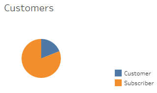

# bikesharing

## Overview of the analysis

The purpose of this project is to analyze Citi Bike - a bike-sharing business in New York City - to determine the viability of starting a similar service in Des Moines. 

### Tableau: <a href="https://public.tableau.com/profile/renata.grodetzky.barbalat#!/vizhome/BikeSharingChallenge_16162697093050/NYCitibikeStory" target="_blank">NY Citibike Story</a>

## Results

The month of August (2019) was selected because it is a beautiful time of the year to rent a bike.

-- There was a total of 2,344,224 rides in the month of August 2019.

 
-- 81% of the users were subscribers of New York Citi Bike.

 
-- Approximately 65% of the trips were taken by male users.

 
-- Most bikes are checked out for less than 1 hour.

 
-- Male users checked out bikes approximately 3 times more than female users.

 
-- During weekdays most rides occur from 7AM to 9AM and from 5PM to 7PM. On weekends, the higher demand is between 10AM and 7PM.

 
-- Female and male users display the same trend, although male users utilize more this service.

 
-- Among subscribers, the most popular days are Thursday, Friday, Tuesday and Monday. Sunday is the day with the lowest utilization. Among regular customers, the most popular day is Saturday.
-- Males rent more than females. 

## Summary

The highest rate of utilization of the bike sharing service in New York City is by subscribers that ride a bike during weekdays in the morning and in the evening. This pattern indicates that this service is being utilized as a way of commuting to/from work.

It would be helpful to perform additional visualizations with this dataset:
- Analyze data from different months during the Winter and Summer.
- Analyze how many bikes are in each station and determine if there are periods when there are no bikes left to be rented, in order to identify the offer and demand for this service.

